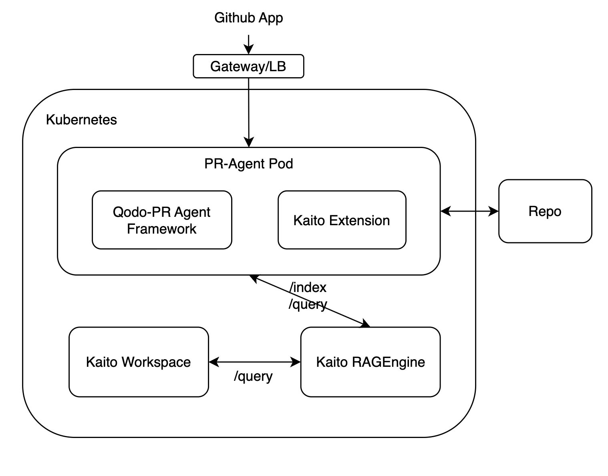

# Kaito PR-Agent

<div align="center">
  
**AI-powered code review automation using Kaito as the backend**

This is a fork of [qodo-ai/pr-agent](https://github.com/qodo-ai/pr-agent) modified for the Kaito project.  
See [NOTICE](NOTICE) for attribution details.

</div>

## Why We Forked PR-Agent

We forked [qodo-ai/pr-agent](https://github.com/qodo-ai/pr-agent) to integrate **Kaito RAGEngine** as the backend, improving PR-Agent's performance by gathering additional context from your codebase. This enhanced contextual understanding allows for more accurate code reviews, better suggestions, and smarter PR descriptions.

---

## 🚀 Quick Start

Get started in minutes with GitHub integration:

### GitHub Action (Recommended)
Easy setup, no infrastructure needed. **[Setup Guide →](docs/docs/installation/github.md#run-as-a-github-action)**

### GitHub App (Advanced)
More control, runs in your infrastructure. **[Setup Guide →](docs/docs/installation/github.md#run-as-a-github-app)**

> **Prerequisites:** You'll need a [Kaito workspace](https://github.com/kaito-project/kaito) running with your preferred model.

> **Live Example:** The kaito-pr-agent GitHub App with Qwen2.5-Coder-32B model is actively reviewing all PRs in the [Kaito repository](https://github.com/Azure/kaito).

---

### Architecture Diagram
This diagram illustrates how the PR-Agent GitHub app works with Kaito.



---

## Setup & Usage

### 1. Run with Docker
For quick testing, use the script below:

```bash
chmod +x scripts/run_docker.sh
./scripts/run_docker.sh
```

### 2. Run in Kubernetes
Apply the job manifest:
```bash
kubectl apply -f config/pr-agent-job.yaml
```

### 3. Run in GitHub Actions

Use the provided workflow in `.github/pr-review.yaml` to automate PR reviews.

---

## Configuration

In all setups, replace the following placeholders with your actual values:

- **OLLAMA_API_BASE** → Your Kaito workspace URL
- **GITHUB_USER_TOKEN** → Your GitHub API token  
- **PR_URL** → The pull request URL to review

Ensure these values are correctly set in your Docker environment, Kubernetes job, or GitHub Actions workflow before running.

## Supported Features

- **Auto Review** (`/review`): AI-powered code review with security and quality feedback
- **Auto Description** (`/describe`): Generate PR titles, summaries, and labels
- **Code Suggestions** (`/improve`): Get improvement suggestions for your code
- **Question Answering** (`/ask`): Ask questions about the PR changes

## Links

- **Original Project**: [qodo-ai/pr-agent](https://github.com/qodo-ai/pr-agent)
- **Kaito Project**: [Azure/kaito](https://github.com/Azure/kaito)
- **Documentation**: [Kaito Docs](https://github.com/Azure/kaito/tree/main/docs)
- **Support**: Open an issue in this repository

## License

See [LICENSE](LICENSE) for license information.

## Credits

This project is a fork of [qodo-ai/pr-agent](https://github.com/qodo-ai/pr-agent). All credit for the original work and core functionality goes to the qodo-ai/pr-agent authors and contributors. We are grateful for their excellent work that made this fork possible.

For detailed attribution information, see [NOTICE](NOTICE).

## Contact

"Kaito devs" <kaito-dev@microsoft.com>
