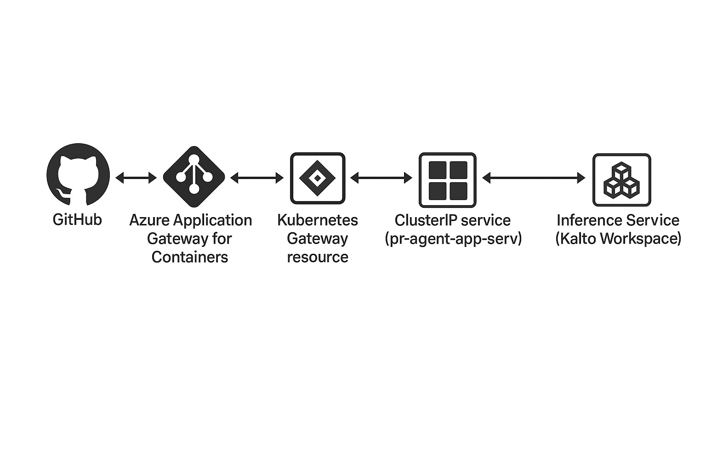

# Kaito PR-Agent

<div align="center">
  
**AI-powered code review automation using Kaito as the backend**

This is a fork of [qodo-ai/pr-agent](https://github.com/qodo-ai/pr-agent) modified for the Kaito project.  
See [NOTICE](NOTICE) for attribution details.

</div>

This repository demonstrates how to run PR-Agent with Kaito as the backend for code review automation. It includes:

- A Kubernetes Deployment to run PR-Agent using Kaito
- A Docker script for local testing
- A GitHub Action for automated reviews

---

### Architecture Diagram
This diagram illustrates how the PR-Agent GitHub app works with Kaito.



---

## Setup & Usage

### 1. Run with Docker
For quick testing, use the script below:

```bash
chmod +x scripts/run_docker.sh
./scripts/run_docker.sh
```

### 2. Run in Kubernetes
Apply the job manifest:
```bash
kubectl apply -f config/pr-agent-job.yaml
```

### 3. Run in GitHub Actions

Use the provided workflow in `.github/pr-review.yaml` to automate PR reviews.

---

## Configuration

In all setups, replace the following placeholders with your actual values:

- **OLLAMA_API_BASE** → Your Kaito workspace URL
- **GITHUB_USER_TOKEN** → Your GitHub API token  
- **PR_URL** → The pull request URL to review

Ensure these values are correctly set in your Docker environment, Kubernetes job, or GitHub Actions workflow before running.

## Supported Features

- **Auto Review** (`/review`): AI-powered code review with security and quality feedback
- **Auto Description** (`/describe`): Generate PR titles, summaries, and labels
- **Code Suggestions** (`/improve`): Get improvement suggestions for your code
- **Question Answering** (`/ask`): Ask questions about the PR changes

## Links

- **Original Project**: [qodo-ai/pr-agent](https://github.com/qodo-ai/pr-agent)
- **Kaito Project**: [Azure/kaito](https://github.com/Azure/kaito)
- **Documentation**: [Kaito Docs](https://github.com/Azure/kaito/tree/main/docs)
- **Support**: Open an issue in this repository

